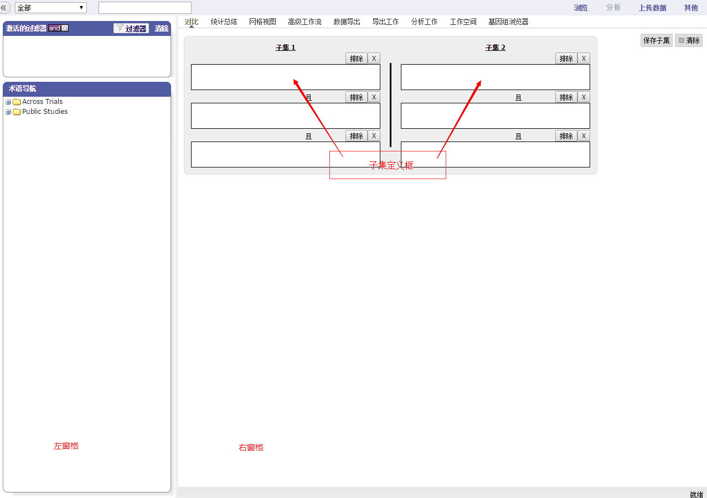

# 操作环境介绍
下面的图显示了数据库管理界面。它分为两个窗格：

**左窗格**
* 让您选择感兴趣的案例
* 提供一种导航树，在这里您可以选择一定条件的案例组成员与案例组之间的比较点。

** 右窗格**
* 让您定义受试者必须满足成为其中两组对比成员的标准。每一个组被称为子集，因为它代表性地仅包含参与案例的真实案例组中的一部分受试者。

您在下面显示的子集定义框的中定义子集的标准。不能满足您定义的标准的受试者将会被排除在子集之外。

* 提供有关主题比较的总结数据和比较的数据的几种不同视图。

下面这张表将描述数据集管理器中右窗格中的标签：

| 标签 | 描述 |
| -- | -- |
| 对比标签 | 删除当前显示的视图（即结果/分析视图，或者网格视图）并重新显示子集定义框。 这允许您进一步细化比较的主题。|
| 统计总结标签  | 显示您指定的查询条件的总结，数据资源管理器运用这些条件来选择子集的受试者。 |
| 网格视图标签 | 用网格格式显示比较和分析的数据 |
| 高级工作流标签 | 显示高级的数据分析和您可以对数据执行的可视化 |
| 数据导出标签 | 允许您选择要导出的数据，这些数据可以用外部工具作进一步的分析 |
| 导出工作标签 | 显示以前导出的工作 |
| 分析工作标签 | 显示从“总结数据”工作流生成的比较和分析数据的图和表 |
| 工作空间标签 | 显示以前运行的分析 |
| 基因组浏览器标签  | 调整基因组浏览器 |

