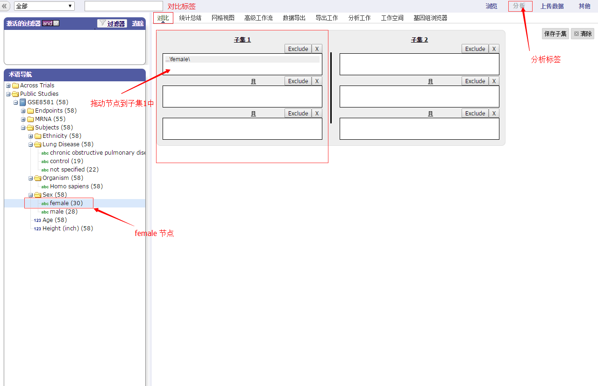
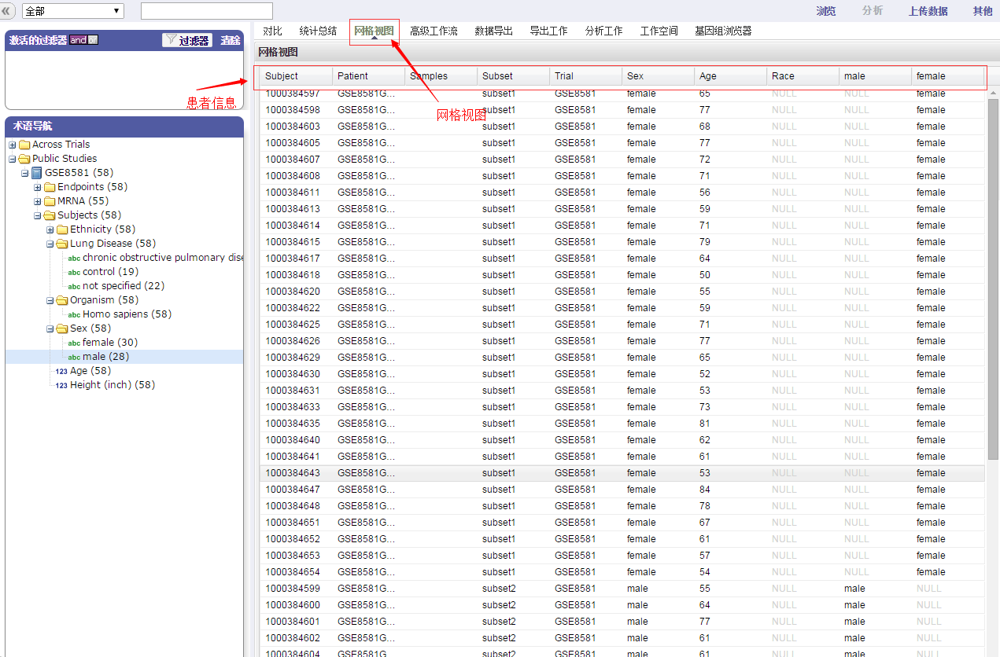
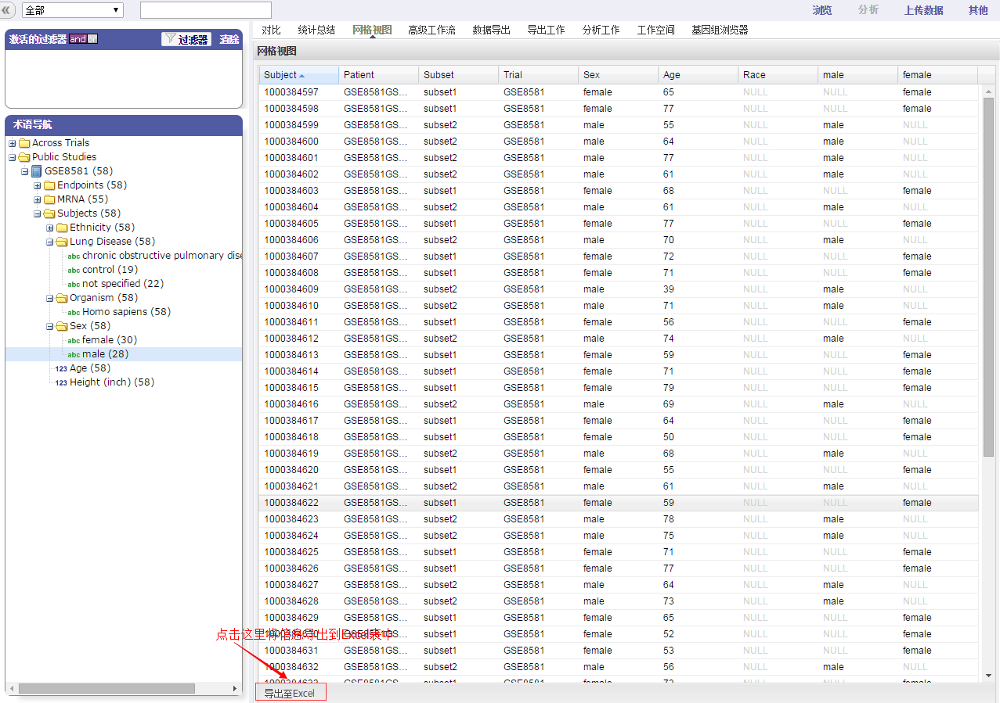

# 网格视图
用网格的格式显示比较和分析的数据。如可以查看患者的年龄，性别，种族等。查看案例中全部男性和女性患者的信息的基本使用说明如下：

1.进入“分析”标签，点击“对比”标签然后通过点击加号图标打开“Sex”目录。拖动'female'节点到子集1中。

2.拖动'male'节点到子集2中，点击“统计总结”标签。可以看到两个个子集的患者的总结数据。

3.点击“网格视图”标签，可以显示两个子集中每一个对象的不同数据。

4.点击'Sample'列标题，然后取消'Sample'复选框。'Sample'列就从网格视图中移除。

5.点击'Subject'列标题可以为表中的数据排序。可以拖动'Age'标签到'Sex'标签前面以改变参数出现的顺序。

6.将表中信息导出到Excel表中。

