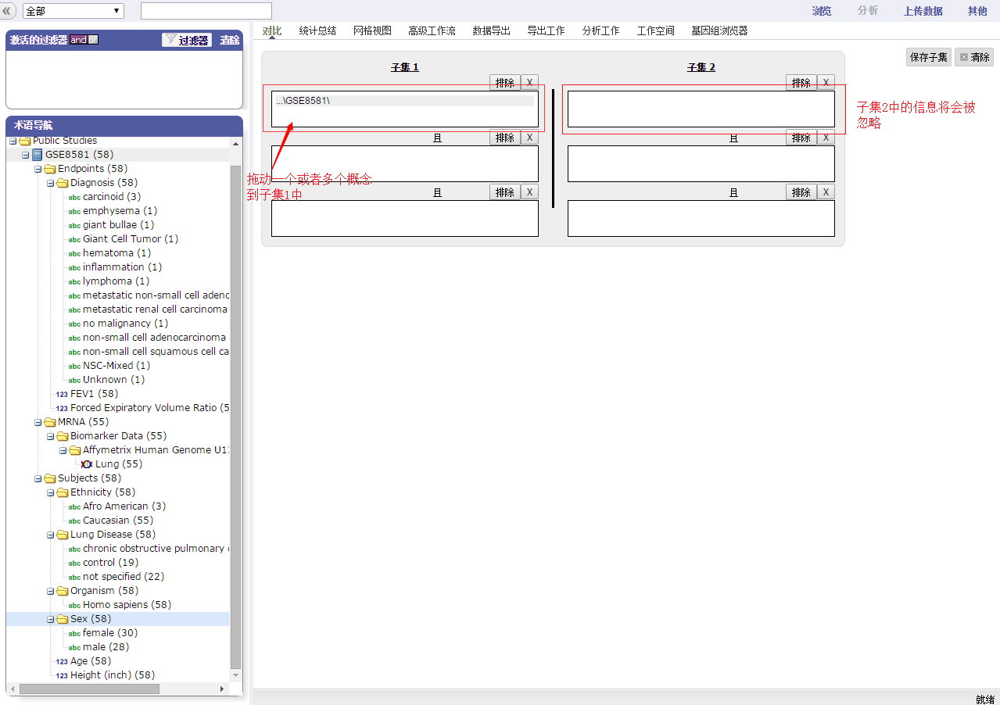
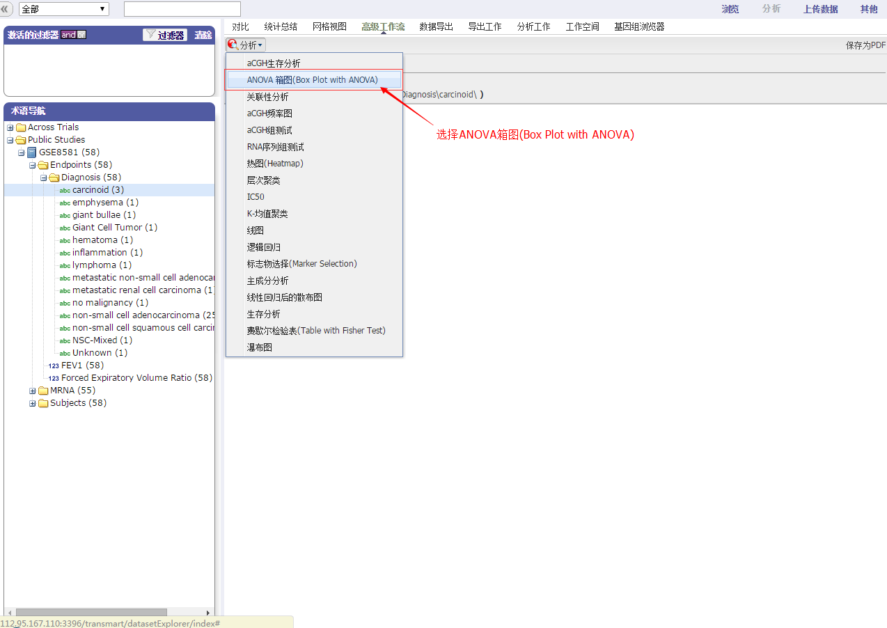
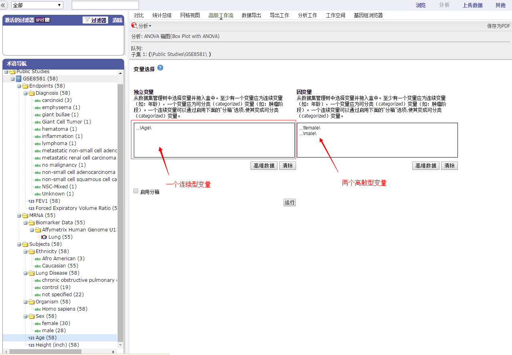
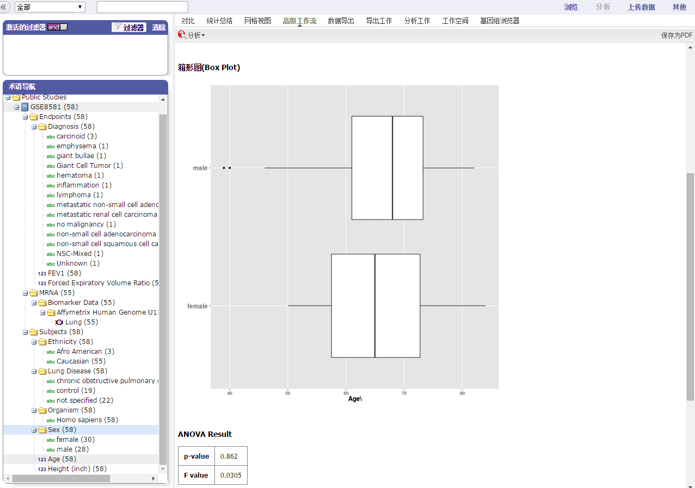
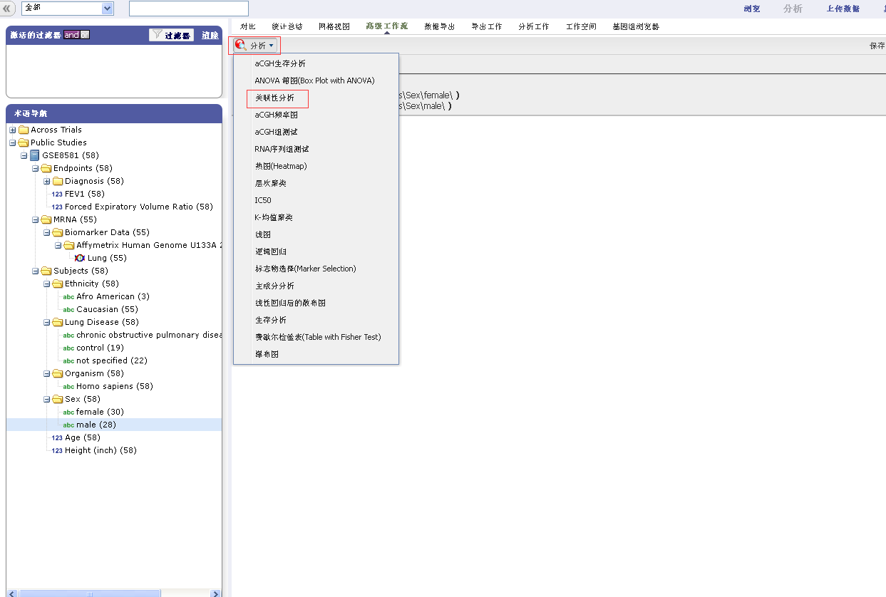
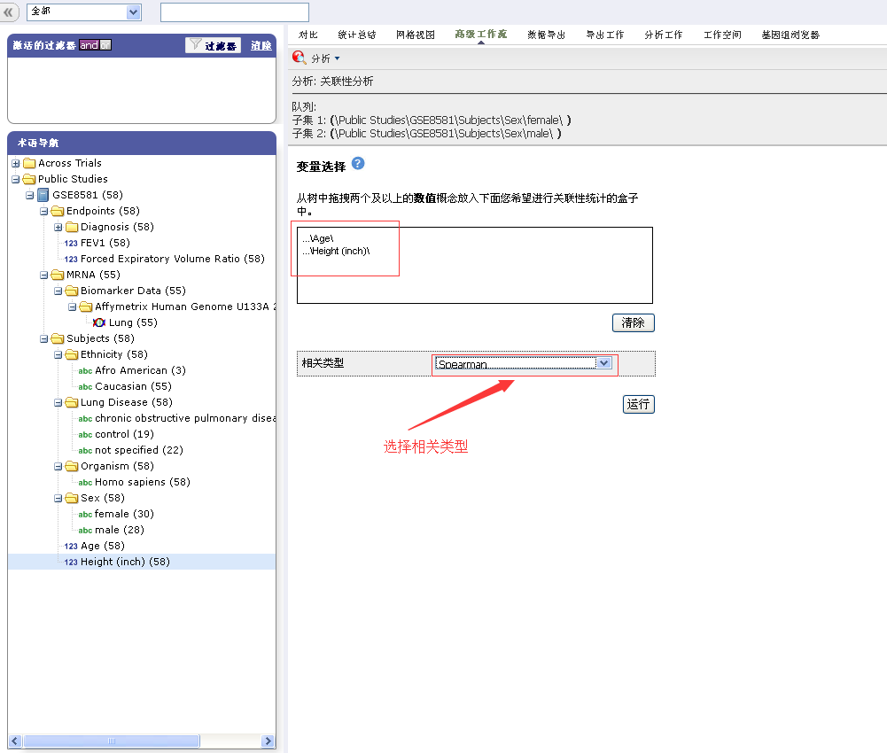
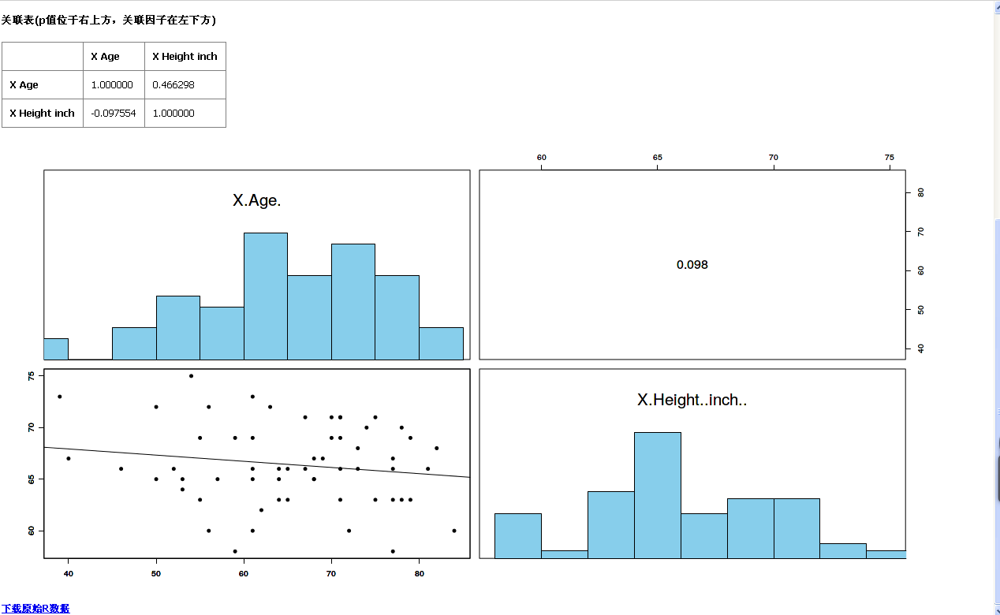
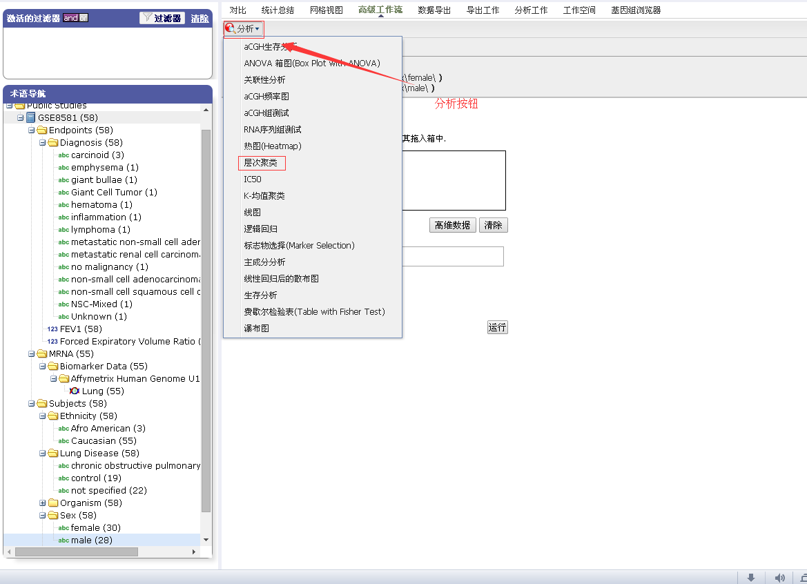
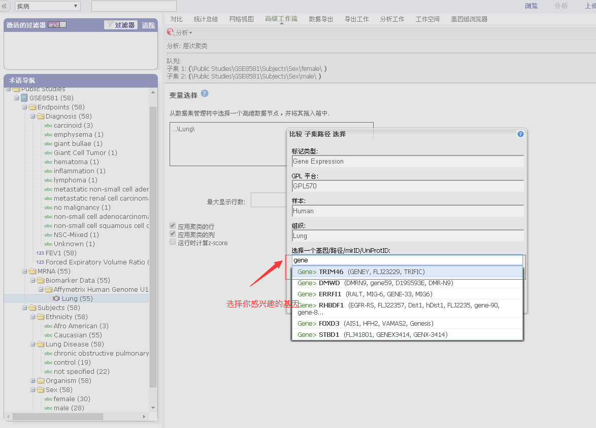
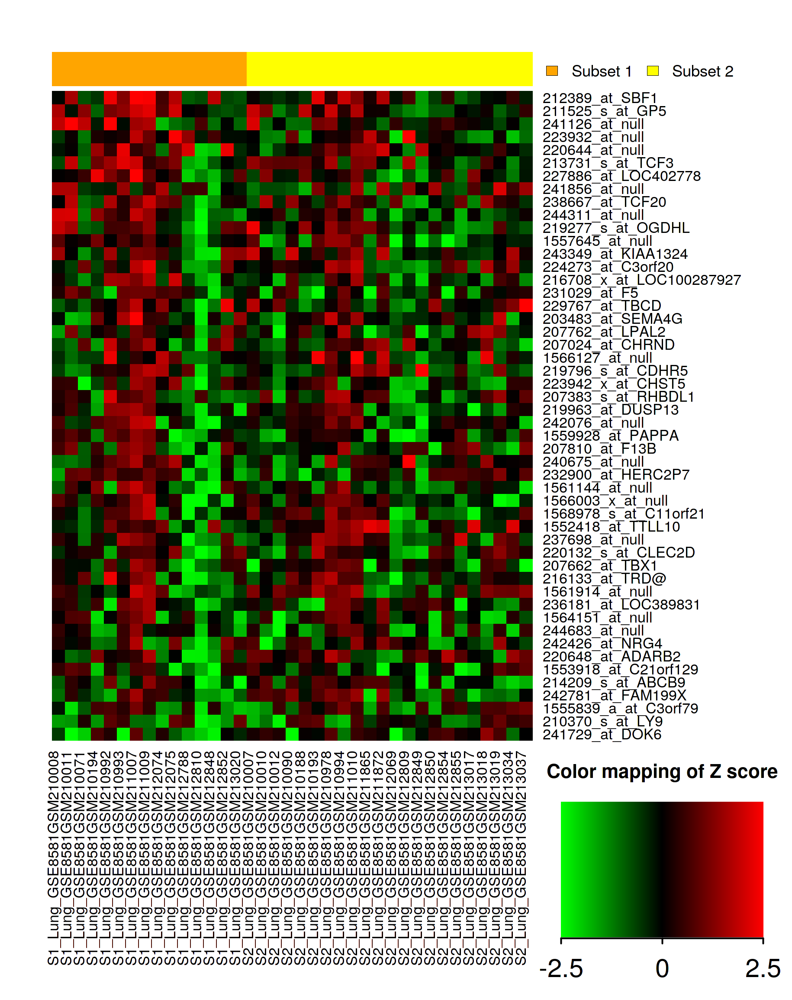

# 高级工作流

This is a test.

tranSMART 提供了数据高级的分析和可视化，允许用户进行如下的数据集管理：
* aCGH生存分析
* ANOVA箱图(Box Plot with ANOVA)
* 关联性分析
* aCGH频率图
* aCGH组测试
* RNA序列组测试
* 热图(Heatmap)
* 层次聚类
* IC50
* K-均值聚类
* 线图
* 逻辑回归
* 标志物选择(Marker Selection)
* 主成分分析
* 线性回归后的散布图
* 生存分析
* 费歇尔检验表(Table with Fisher Test)
* 瀑布图

数据集管理器使用R软件环境进行数据计算，生成分析和可视化。有关更多信息，请访问：http://www.r-project.org.

## 热图(Heatmap)
在一个数据集管理器中，生物标志会出现在y轴上，受试者会出现在x轴上。生成一个热图步骤如下：

1.进入'分析'标签，拖动'female'节点到子集1中，然后拖动'male'节点到子集2中。

2.进入'高级工作流'标签，点击'分析'选择按钮，选择'热图'分析。

3.在变量选择框中拖入一个高维的数据节点，如'Lung'节点。点击'高维数据'按钮，在选择一个基因中中输入'Gene'，在弹出的选择项中选择一个您感兴趣的基因，最后点击应用选择。

4.点击'运行'按钮，生成热图。

## ANOVA箱图(Box Plot with ANOVA)
用ANOVA箱图显示样品中的盒状图和相应的方差分析线图。

生成一个ANOVA箱图步骤如下：

1.运行tranSMART，然后点击'分析'标签。

2.通过从一个案例中拖动一个或者更多的概念到子集定义框中来定义您希望选择的队列。
* 只有一个子集可以被指定在这个分析方法中，在子集2中的信息将会被忽略。

3.点击'高级工作流'标签,从弹出的列表中选择ANOVA箱图(Box Plot with ANOVA)

4.在变量选择区出现后，您将需要确定在案列中那些变量是自变量，以及那些变量是因变量。至少一个变量应该是连续的（例如，年龄），一个变量应该是离散的（例如，组织型）。
* 如果自变量定义成组，盒子将会被绘制成水平方向上的。如果
因变量定义成组，盒子将会被绘制成垂直方向上的。

5.定义变量。
* 在这个例子中，数据的分箱特性是没有被使用的。作为将来的参考，数据分箱是指一种预处理技术用于减少小的观测误差。数据群集被集群的值代表取代（核心价值）。

6.点击'运行'按钮。您的分析结果将会自动产生。

##关联性分析

关联性分析是研究现象之间是否存在某种依存关系，并对具体有依存关系的现象探讨其相关方向以及相关程度。执行一个关联性分析步骤如下：

1.进入'分析'标签，定义你所想要分析的案例，通过拖放一个或多个主题放到空的子集定义栏。例如，拖动'female'节点到子集1中，然后拖动'male'节点到子集2中。

2.进入'高级工作流'标签，点击'分析'选择按钮，选择'关联性分析'。

3.在变量选择框中拖入两个或两个以上的数值放入关联性统计的盒子中，如'年龄'和'身高'节点。并选择一个你感兴趣的关联类型。

4.点击'运行'按钮，你的分析如下：

##层次聚类
层次聚类是在基因表达数据中的相关数据点的可视化模式。生成一个层次聚类热图步骤如下：

1.进入'分析'标签，定义你所想要分析的案例，通过拖放一个或多个主题放到空的子集定义栏。例如，拖动'female'节点到子集1中，然后拖动'male'节点到子集2中。

2.进入'高级工作流'标签，点击'分析'选择按钮，选择'层次聚类'分析。

3.在变量选择框中拖入一个高维的数据节点，如'Lung'节点。点击'高维数据'按钮，选择你所感兴趣的因子，如在选择一个基因中中输入'Gene'，在弹出的选择项中选择一个您感兴趣的基因，最后点击应用选择。

4.点击'运行'按钮，生存热图。

