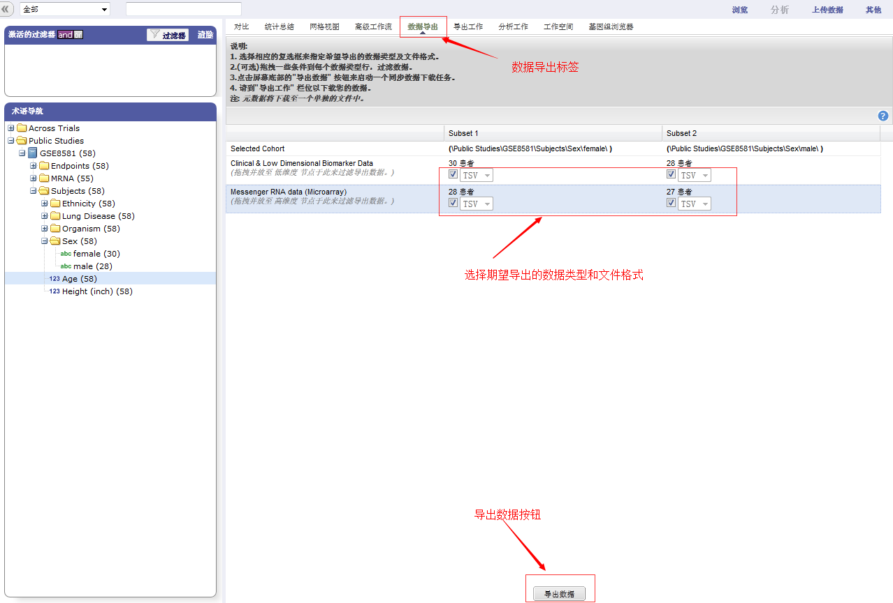
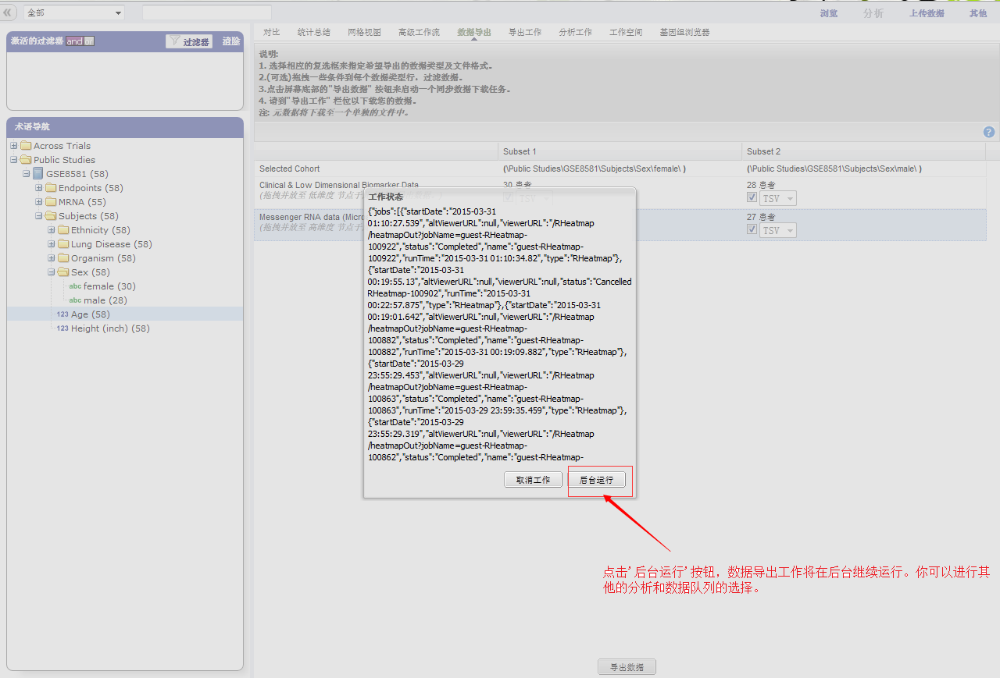

# 数据导出
'数据导出'标签允许您以几种不同的格式导出本地数据，以作进一步的分析。

支持的文件格式包括：
* 临床和低维的生物标志数据
* 基因表达数据
* SNP 数据
* 基因集合富集分析(GSEA)

有关GSEA数据文件更多的信息，请访问下面的网站：

http://www.broadinstitute.org/cancer/software/gsea/wiki/index.php/Data_formats

导出数据集管理器的数据的步骤如下：

1.点击'分析'标签，拖动需要导出的数据节点到子集框中。

2.点击'数据导出'标签，选中期望导出的数据类型和文件格式的复选框。

3.点击'数据导出'按钮，数据导出命令将会开始工作。您可以选择在后台运行数据导出工作，以便能够继续其他的分析和队列的选择。这项工作可能需要几分钟，这取决于您的选择的数据量。

4.点击'导出工作'标签可以查看完成的工作或检查在等待的工作的状态

5.点击您正在处理的工作的名称，就会出现打开文件对话框：

6.选择保存文件，然后点击'确定'按钮.您的文件将会以".zip"文件格式发送到您本地机器的下载的文件夹中。

